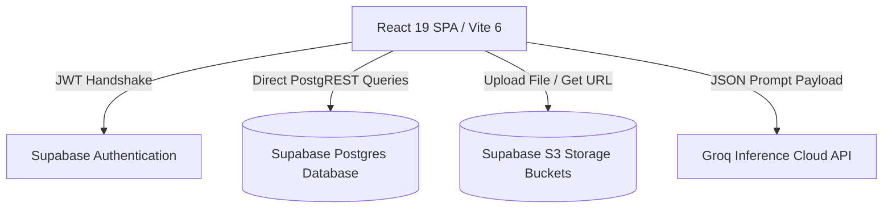
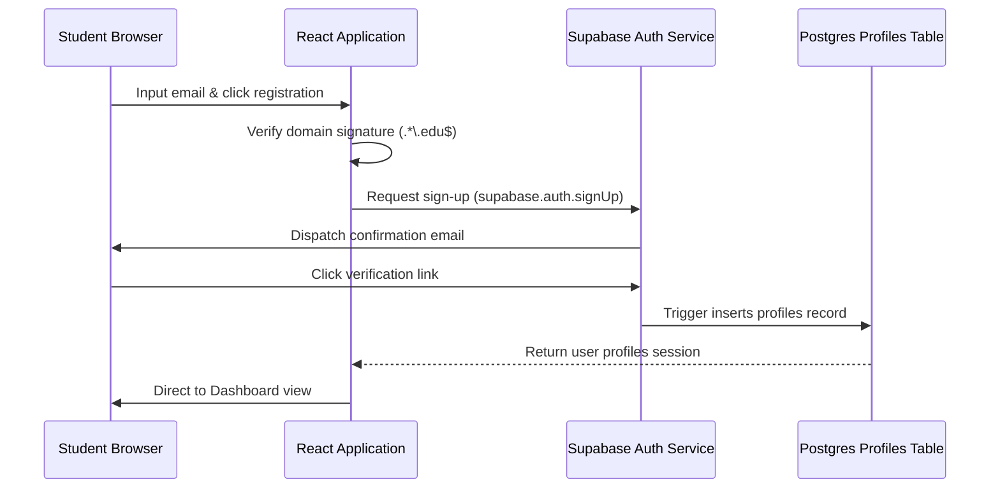
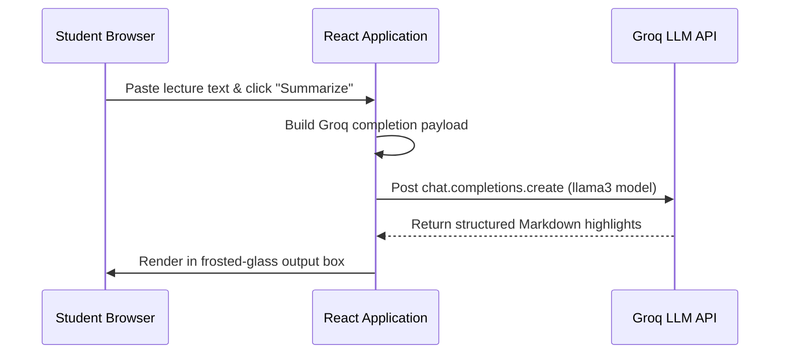

# System Architecture: CampusConnect Hub

## 1. High-Level Architectural Block Diagram
CampusConnect Hub utilizes a Jamstack model where client-side React routes request serverless BaaS resources directly:



- **Client Layer:** Renders glassmorphic UI templates. Transitions themes dynamically by toggling `.dark` class selectors.
- **BaaS Layer (Supabase):** Manages user session tokens, Postgres tables, and storage buckets.
- **Inference Layer (Groq):** Generates AI referral emails and note summaries.

---

## 2. System Sequence & Data Flow Workflows

### 2.1. Authentication Sequence


### 2.2. Dynamic Telemetry Data Loading
To populate the Dashboard metrics, the client executes lightweight HTTP count queries:
```javascript
const { count, error } = await supabase
  .from('listings_housing')
  .select('*', { count: 'exact', head: true })
  .eq('is_active', true);
```
- **Performance Benefit:** Setting `head: true` forces Postgres to return count totals in header headers, skipping data downloading to optimize network speed.

### 2.3. AI Summary Pipeline


---

## 3. Security Architecture & RLS Protection
Database tables are secured using Supabase Row-Level Security (RLS) policies:

| Target Table | Action | Policy Condition | RLS Policy Rule |
| --- | --- | --- | --- |
| **profiles** | SELECT | Read public profiles | `true` (any logged in user) |
| **profiles** | UPDATE | Write own profile details | `auth.uid() = id` |
| **listings_housing** | INSERT | Create housing listing | `auth.uid() = user_id` |
| **listings_housing** | UPDATE | Modify own listings | `auth.uid() = user_id` |
| **listings_marketplace** | INSERT | Create marketplace listing | `auth.uid() = user_id` |
| **listings_marketplace** | UPDATE | Modify own merchandise | `auth.uid() = user_id` |

---

## 4. Performance, Optimization & Code Splitting
- **Dynamic Imports:** Avoid loading all modules on landing. Implement React code-splitting (`React.lazy()`) for resource-heavy modules.
- **Tailwind Cascade Layering:** Nest custom browser resets inside `@layer base` block to prevent resets from overriding class utilities:
  ```css
  @layer base {
    * { margin: 0; padding: 0; }
  }
  ```
