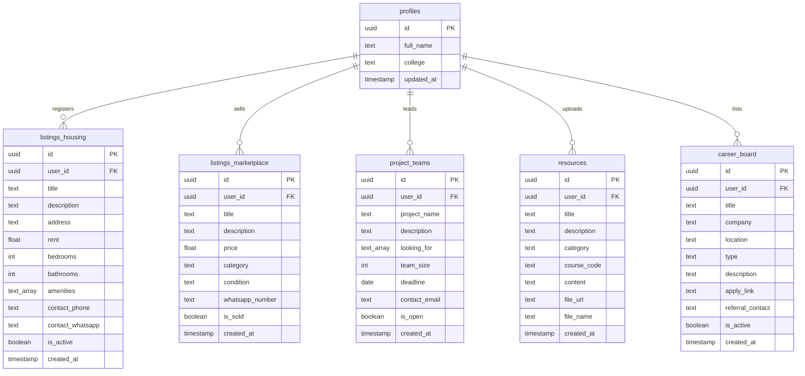

# MVP Technical Documentation: CampusConnect Hub

## 1. Tech Stack Architecture
The CampusConnect Hub MVP is built on an optimized serverless architecture, delivering speed, security, and responsive styling:

```text
               ┌──────────────────────────────────────┐
               │    React 19 SPA client (Vite 6)     │
               └──────────────────┬───────────────────┘
                                  │
         ┌────────────────────────┼────────────────────────┐
         ▼                        ▼                        ▼
┌─────────────────┐      ┌─────────────────┐      ┌─────────────────┐
│  Supabase Auth  │      │  Postgres DB    │      │  Groq Cloud API │
│  (JWT Tokens)   │      │  (Row-Level RLS)│      │  (Llama-3 LLM)  │
└─────────────────┘      └─────────────────┘      └─────────────────┘
```

- **Frontend Client:** React 19 SPA bundled with Vite 6. Utilizes Tailwind CSS v4's visual utility engine.
- **Backend Services:** Supabase provides user authentication, Postgres relational storage, and file hosting.
- **AI Processing:** Groq Cloud SDK executes LLM queries client-side via secure API keys.

---

## 2. Postgres Database Relational Schema

Database tables are stored in Supabase Postgres. All references link back to the authenticated profiles primary key.

### 2.1. System Entity Relationship Diagram


---

## 3. Storage Bucket & Folder Policies
- **Bucket ID:** `resources`
- **File System Structure:** `resources/{user_id}/{filename}`
- **Security Control (Supabase storage policies):**
  - Read: Public read allowed.
  - Insert: Allowed only for authenticated users where owner matches UUID:
    ```sql
    (role() = 'authenticated') and (bucket_id = 'resources')
    ```

---

## 4. Frontend Component Tree & File Dependencies
```text
src/
├── components/
│   ├── auth/
│   │   └── AuthPage.jsx          # Educational email domain checker & login tab
│   ├── layout/
│   │   └── AppLayout.jsx         # Sidebar navigation links, mobile header & drawer
│   ├── modules/
│   │   ├── Dashboard.jsx         # Telemetry snapshot cards, timeline & navigation
│   │   ├── HousingHub.jsx        # Inline housing grids, filters bar
│   │   ├── Marketplace.jsx       # Non-overlapping badges, WhatsApp contact triggers
│   │   ├── TeamUp.jsx            # Teammate cards, capacity bar
│   │   ├── CareerBoard.jsx       # Internship roles, AI Referral drawer
│   │   └── Resources.jsx         # Lecture folders, AI Notes Summarizer drawer
│   └── ui/
│       ├── Button.jsx            # Standard click targets (min 44px)
│       ├── Card.jsx              # Frosted glass card panel
│       ├── Drawer.jsx            # Swipe overlay container
│       ├── Input.jsx             # Tailwind v4 form inputs
│       └── Textarea.jsx          # Form input boxes
├── contexts/
│   ├── AuthContext.jsx           # Supabase signin handler
│   └── ThemeContext.jsx          # persistent localstorage theme selector
├── lib/
│   ├── supabase.js               # Supabase credentials loader
│   └── utils.js                  # class joiner
├── services/
│   └── groq.js                   # Prompt completion templates
├── App.jsx                       # Switch-case router routing default to dashboard
├── index.css                     # Custom cascade layer styling baseline
└── main.jsx                      # DOM render node
```

---

## 5. Local Setup, Config & Build Pipeline

### 5.1. Setup Instructions
1. Clone the project and run dependencies installation:
   ```bash
   npm install
   ```
2. Populate the `.env` parameters:
   ```env
   VITE_SUPABASE_URL=https://your-project.supabase.co
   VITE_SUPABASE_ANON_KEY=eyJhbGciOiJIUzI1NiIsInR5cCI6IkpXVCJ9...
   VITE_GROQ_API_KEY=gsk_your_key_here
   ```
3. Run local Vite server:
   ```bash
   npm run dev
   ```

### 5.2. Build & Production Check
Verify bundle compilation before pushing commits:
```bash
npm run build
```
This runs the compiler checks, compiling JS chunks and global CSS variables into the production `dist/` directory.
