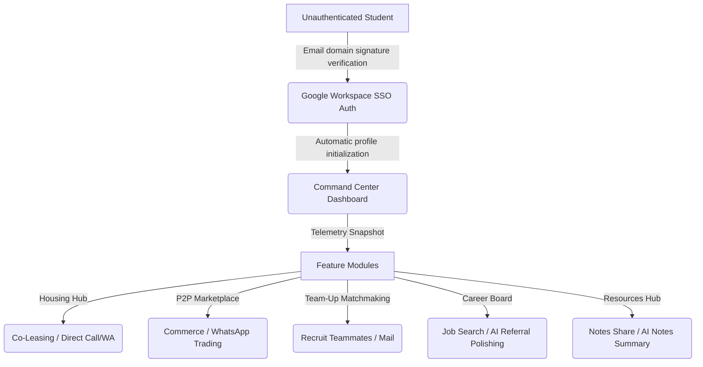

# Product Requirements Document (PRD): CampusConnect Hub

| Attribute | Specification |
| --- | --- |
| **Status** | Approved |
| **Version** | v1.0.0 (MVP) |
| **Target Launch** | Fall Semester 2026 |
| **Document Owners** | Principal UI/UX Architect & Product Team |

---

## 1. Executive Summary & Vision
CampusConnect Hub is a verified academic workspace designed to centralize student interactions within a single, secure environment. By utilizing institutional single-sign-on (SSO) and educational email verification constraints (`.edu` / `.ac.uk` signatures), the platform replaces scattered third-party channels (Reddit threads, Slack nodes, WhatsApp chats) with a trusted workspace. 

### Vision Statement
*To provide university students with a cohesive, secure, and hyper-efficient digital campus containing peer-to-peer housing co-leasing, supply trading, team-building, career assistance, and document libraries, powered by fast local AI capabilities.*

---

## 2. Target Personas & User Journeys

### 2.1. Persona Profiles
1. **The Off-Campus Seeker:** Needs safe, local accommodation. Wants roommate transparency, clean pricing, and verification that listing owners are active students.
2. **The Student Trader:** Wants to trade textbooks and electronics locally. Avoids shipping delays or meetup safety concerns.
3. **The Project Leader:** Needs teammates for hackathons or assignments. Seeks specific skill profiles and wants a way to monitor team slots.
4. **The Career Candidate:** Looking for internships. Seeks employee referrals and needs AI tools to draft outreach messages.
5. **The Study Partner:** Shares notes and study sheets. Uses AI tools to get quick, structured takeaways from class materials.

### 2.2. Core User Flow

---

## 3. Product Features & Requirements Matrix

### F01: Authentication & Domain Validation
- **Requirement:** Accept registrations strictly from authorized academic domains (e.g., `*@*.edu`, `*@*.ac.uk`).
- **SSO Integration:** Provide a one-click Google Workspace integration.
- **Accountability notice:** A prominent warning block stating code of conduct expectations and Dean-level escalation pathways for violations.

### F02: Command Center Dashboard
- **Telemetry Snapshots:** 4 frosted glass cards reporting live Postgres counts for housing, trading items, team requests, and notes folders.
- **Insights Tracker:** Chronological timeline showing real-time listings notifications.
- **Action Hub:** Deep-link quick buttons navigating directly to targeted listing creations.

### F03: Housing Hub
- **Inline Attributes:** Card displays rent rate, bedroom layout, bathroom count, and amenities.
- **Filters Deck:** Expands directly above the search bar. Filters listings by budget and capacity constraints.
- **Outreach CTAs:** Touch targets (min 44px) for dialers and preformatted WhatsApp redirection links.

### F04: Marketplace Commerce
- **Categorization Badges:** Color-coded categories (Electronics, Books, Furniture, etc.) and item condition indicators (New, Like New, Good).
- **CTA Actions:** Instant WhatsApp contact triggers locked to card footers.

### F05: Team-Up Matchmaking
- **Skill Requirements:** Non-overlapping badges detailing targeted framework competencies.
- **Capacity Bars:** Progress bars displaying remaining team spaces.
- **Outreach Blocks:** Mail triggers and copy utilities with visual feedback states.

### F06: Career Board & AI Referral Assistant
- **Position Type Sorting:** Filters for Internship, Co-op, Full-Time, Part-Time, and Research roles.
- **AI Referral Drawer:** Overlay sheet where students input rough notes, and a Groq API model generates a polished cold email draft.

### F07: Resources Hub & AI Summarizer
- **Course Code Tags:** Monospaced tags (e.g., `CS-101`) to categorise shared course files.
- **AI Summarization Drawer:** Text extraction engine utilizing LLMs to synthesize key takeaways and objectives from pasted lecture notes.

---

## 4. UI/UX & Non-Functional Specifications
- **Visual Design:** Glassmorphism (`glass` and `glass-card` classes) featuring blur layers, high-contrast text, subtle gradients, and dark background overrides (`bg-slate-950`).
- **Workspace Theme Switcher:** Flippable dark/light system toggle class on the HTML root element storing preference in `cc-theme` key.
- **Responsive Layout:** Hiding navigation sidebars into slide-out hamburger menus on viewport sizes below `1024px` width.
- **Truncation Boundaries:** Enforce `line-clamp-1` on titles and `line-clamp-3` on descriptions to prevent card breaks.
