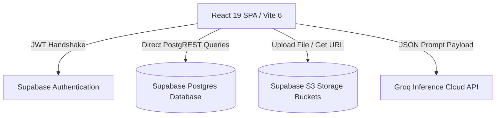
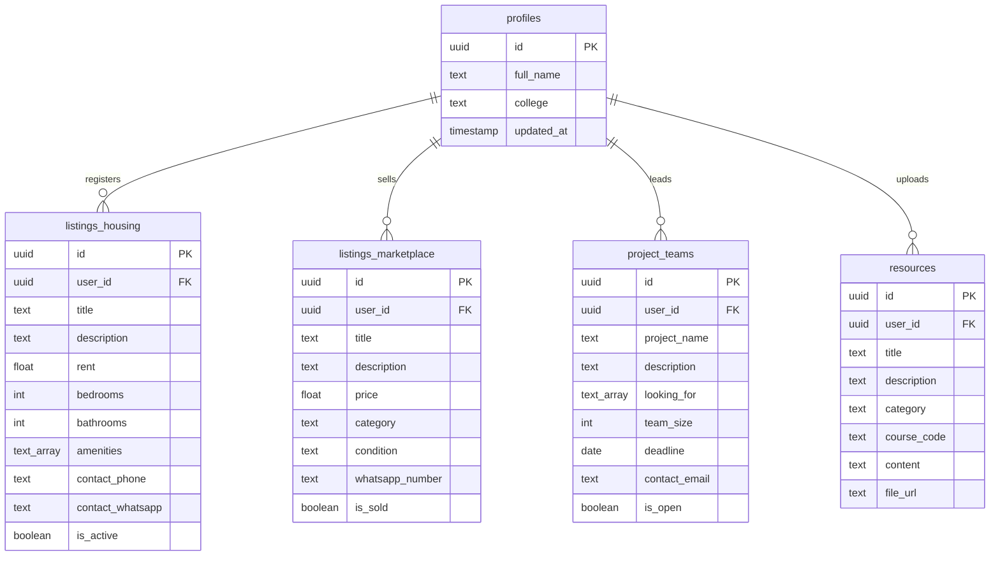

# CampusConnect Hub: Presentation Slides

You can view these slides sequentially or export this structure to a standard PowerPoint (.pptx) file.

---

## 🎬 Slide 1: Project Overview
### CampusConnect Hub
**The Verified Student Command Center & Collaborative Portal**

- **Project Type:** Mini-Project / Portfolio Showcase
- **Core Technology:** React 19, Vite 6, Tailwind CSS v4, Supabase, Groq AI API
- **Visual Aesthetic:** Premium glassmorphism with high-contrast light/dark workspaces
- **Target Launch:** Academic Term 2026

---

## ⚠️ Slide 2: Problem Statement

University campuses suffer from communication fragmentation and security gaps:
- **Fragmented Channels:** Students use a mix of Slack channels, WhatsApp groups, Reddit pages, and physical bulletin boards to trade goods, search for accommodation, or build hackathon teams.
- **Security & Safety Threats:** Public platforms (Reddit, Craigslist, Facebook groups) do not verify student status, exposing students to off-campus rental scams, bot accounts, and marketplace fraud.
- **Inefficient Team Matchmaking:** Finding teammates with specific frameworks skills (e.g., Python, React, ML) is manual, slow, and unorganized.
- **Unused Study Assets:** Hard-earned study notes, exam reviews, and guidelines go unshared or get buried in personal drives.

---

## 👥 Slide 3: Target User Segments

CampusConnect Hub serves 5 primary student segments:
1. **The Off-Campus Renter:** Students searching for safe housing, roommate transparency, and verified peer-led subleasing options.
2. **The Student Trader:** Students wanting to buy or sell textbooks, gadgets, and supplies locally within safe university boundaries.
3. **The Teammate Recruiter:** Students, developers, and UI designers recruiting peers for university courses, research labs, or hackathons.
4. **The Career Hustler:** Students seeking job applications, employee referrals, and professional email polishers.
5. **The Academic Contributor:** Students sharing exam guides and slides who want instant, structured study takeaways.

---

## 💡 Slide 4: Value Proposition

CampusConnect Hub delivers value through trust, consolidation, and AI productivity:

```text
  ┌────────────────────────────────────────────────────────┐
  │                   CAMPUSCONNECT HUB                    │
  ├────────────────────────────────────────────────────────┤
  │  🔒 TRUST & SAFETY      - Strict .edu email login locks│
  │  📊 DASHBOARD ENGINE    - Real-time campus telemetry   │
  │  💬 P2P MARKETPLACE     - Preformatted WhatsApp chats  │
  │  🤝 TEAM MATCHMAKING    - Active skill tags & vacancy  │
  │  🧠 AI DRAWERS          - Fast summaries & polished pitches
  └────────────────────────────────────────────────────────┘
```

- **Safety Guarantee:** Eliminates external accounts by enforcing academic SSO domain verification.
- **Consolidated Panel:** Connects housing, trading, team-building, career boards, and resource drives.
- **AI Acceleration:** Groq API-powered note summarizers and outreach polishers help students work faster.

---

## 🤝 Slide 5: Customer Relationships & Channels

How the platform connects, engages, and monitors user interactions:

### Customer Relationships
- **Self-Service Community:** Students manage their own listings, listings updates, and direct peer-to-peer chats.
- **Peer-to-Peer Trust:** Direct transactions with verified classmates establish high trust.
- **Dean-Level Code Enforcement:** Explicit legal disclaimers warn that misbehavior will result in academic suspension and Dean-level reports.

### Channels
- **University Workspace Integration:** Instant login matching via university Google Workspace SSO.
- **Campus Promotion:** Student associations, hackathon organizers, and housing boards.
- **Direct P2P Outreach:** Integrated WhatsApp click-to-chat links, direct dial calls, and custom mailto links.

---

## 🔧 Slide 6: Key Resources & Partners

The technical foundation supporting CampusConnect Hub:

### Key Resources
- **Supabase BaaS Architecture:** Manages authenticated user credentials, relational Postgres tables, and S3 asset buckets.
- **React 19 SPA Frontend:** Uses Vite 6 for fast client-side routing, modular feature rendering, and hot reloads.
- **Tailwind CSS v4 Engine:** Powers visual components with custom base resetting layers and frosted-glass utility tokens.

### Key Partners
- **Google Workspace SSO:** Handles secure login verification.
- **Groq Cloud API:** Executes LLM inference client-side.
- **WhatsApp Web API:** Redirects students to direct chat boxes.

---

## 💸 Slide 7: Cost Structure & Revenue Plan

Analysis of operating expenses and funding sources:

### Cost Structure
- **Database Storage Hosting:** Supabase Postgres and S3 file storage usage fees.
- **AI Processing Costs:** Groq Cloud completion API usage costs (calculated per thousand tokens generated).
- **Hosting Bandwidth:** Vercel production hosting bandwidth fees.

### Revenue & Funding Strategy
- **Free Basic Tier:** Zero-cost listing and search tools for verified students.
- **University Sponsorships:** Universities pay subscription packages to host CampusConnect as an official campus portal, keeping the platform ad-free.
- **Premium Upgrades:** Small fees for premium feature promotions (e.g., pinning a housing sublease to the top of the board).

---

## 🏗️ Slide 8: Technical System Architecture

A Jamstack single page application powered by a serverless backend:



- **Secure Login:** Validates `.edu` email domains before allowing registrations.
- **Optimized Counts:** Dashboard statistics load using lightweight queries (`head: true` option) to fetch counts without downloading full records.
- **Secure File Storage:** Users upload notes directly to Supabase storage, creating signed URLs.

---

## 🗃️ Slide 9: Relational Database Schema



---

## 🧠 Slide 10: Key Features & AI Capabilities

Advanced developer features included in the MVP:

- **AI Note Summarizer (Resources Hub):** Custom prompts send pasted notes to Groq API models, generating markdown files highlighting definitions, study formulas, and core summaries.
- **AI Referral Polisher (Career Board):** Converts rough bulleted experience points into professional cold email templates for requesting employee referrals.
- **Interactive Forms:** Real-time form validators ensure listings are complete before database insertions.
- **Cascade Layer Resets:** Reset styles are layered inside base directives to protect Tailwind utility spacing, preventing layout breaks.
