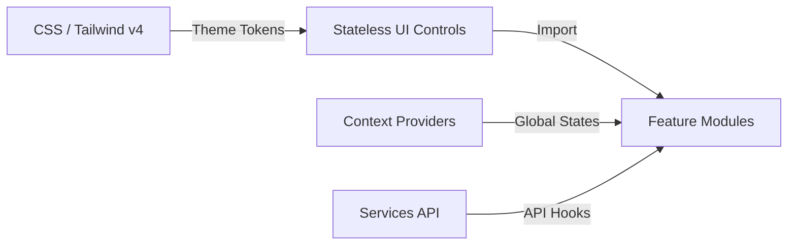

# System Design Document: CampusConnect Hub

## 1. Design Patterns & Modular Structure
CampusConnect Hub utilizes a component-driven pattern, separating layout structures from core business utilities:



- **Atomic Components:** Shared UI controls (e.g. `Card`, `Drawer`) containing zero local state variables, reading styles directly from parameters.
- **Feature Modules:** Feature sections (e.g. `HousingHub`, `Marketplace`) managing modular inputs and database queries.
- **Context Services:** Centralized state hubs managing logins (`AuthContext`) and theme preferences (`ThemeContext`).

---

## 2. Front-End Component Design & Reusability

### 2.1. Atomic UI Specifications
To prevent duplicate CSS styles, component parameters are unified:
- **`Card` Component:** Implements the `glass-card` class, adapting card outlines to light frosted-white glass or dark slate glass depending on root themes.
- **`Drawer` Component:** Implements overlay panels using slide animation classes (`animate-slide-in-right`). Used dynamically by the notes summarizer and job referral assistant.
- **`Button` Component:** Restricts click targets to touch-safe heights (`h-11` or `44px`) to conform to mobile guidelines.

### 2.2. CSS Layer Cascade & Transitions (`index.css`)
Global transitions are layered under `@layer base` to allow Tailwind's utility padding (`p-5`, `p-6`) to take precedence:
```css
@layer base {
  * {
    margin: 0;
    padding: 0;
    box-sizing: border-box;
    transition: background-color 0.2s ease, border-color 0.2s ease;
  }
}
```

---

## 3. Database Integrity & Database Schema Scripts

Database tables are configured in Postgres. The following SQL setup scripts define tables, RLS permissions, and triggers:

```sql
-- 1. Create profiles database table
create table public.profiles (
  id uuid references auth.users on delete cascade primary key,
  full_name text not null,
  college text not null,
  updated_at timestamp with time zone default timezone('utc'::text, now()) not null
);

-- 2. Configure Row Level Security (RLS)
alter table public.profiles enable row level security;

create policy "Allow public profiles read access"
  on public.profiles for select
  using (true);

create policy "Allow profile owners updates"
  on public.profiles for update
  using (auth.uid() = id);

-- 3. Automatic profiles builder function on user signups
create function public.handle_new_user()
returns trigger as $$
begin
  insert into public.profiles (id, full_name, college)
  values (
    new.id,
    coalesce(new.raw_user_meta_data->>'full_name', 'New Student'),
    coalesce(new.raw_user_meta_data->>'college', 'University Member')
  );
  return new;
end;
$$ language plpgsql security definer;

-- 4. Assign profile trigger
create trigger on_auth_user_created
  after insert on auth.users
  for each row execute procedure public.handle_new_user();
```

---

## 4. Scalability & Performance Strategy
- **Exact Count Head Queries:** When fetching totals on the Dashboard module, execute head-count requests to Postgres instead of downloading complete rows.
- **Responsive Layout Grids:** Enforce fluid auto-fit grids (`grid-cols-1 md:grid-cols-2 lg:grid-cols-3 xl:grid-cols-4`) on all list views to prevent overflow scrollbars.
- **Image Resizing Pipelines:** Force image uploads to pass through scale compressors before bucket storage, keeping page sizes under 1MB.
